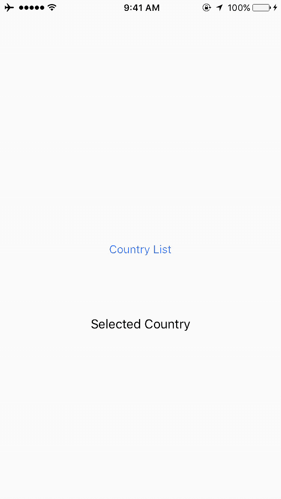

# CountryList
> A simple iOS framework that allows developers to present a list of countries.

[![Swift Version][swift-image]][swift-url]
[![Build Status][travis-image]][travis-url]
[![License][license-image]][license-url]
[](https://cocoapods.org/pods/CountryList)
[](https://cocoapods.org/pods/CountryList)

CountryList makes it easy to present the user with a list of Countries and their respective information, like country code, phone extension and flag.



## Contents

* [Requirements](#requirements)
* [Installation](#installation)
    * [CocoaPods](#cocoapods)
    * [Manually](#manually)
* [Usage](#usage)
* [Notes](#notes)
* [Contribute](#contribute)
* [License](#license)

## Requirements

- iOS 9.0+
- Xcode 7.3+

## Installation

#### CocoaPods
You can use [CocoaPods](http://cocoapods.org/) to install `CountryList` by adding this to your `Podfile`:

```ruby
use_frameworks!
pod 'CountryList'
```
If you get the ``Unable to find a specification for `CountryList`.``  error after running `pod install`.

Run the following commands on your project directory:
```
pod repo update
```
```
pod install
```
#### Manually
1. Drag and drop ```CountryList.swift``` ```Countries.swift``` ```Country.swift``` ```CountryCell.swift``` in your project.  
2. That's it!

## Usage
1. Import `CountryList` module to your `ViewController` class
```swift
import CountryList
```
2. Add `CountryList` to `ViewController`, then set the delegate for it to self.
```swift
class ViewController: UIViewController {

        var countryList = CountryList()

        override func viewDidLoad() {
                super.viewDidLoad()

                countryList.delegate = self
        }
}
```
3. Conform your `ViewController` to `CountryListDelegate` protocol and implement all the methods, e.g.
```swift
class ViewController: UIViewController, CountryListDelegate {

        func selectedCountry(country: Country) {
                print(country.name)
                print(country.flag)
                print(country.countryCode)
                print(country.phoneExtension)
        }
}
```
4. Present the `CountryList` view on `ViewController` e.g.
```swift
class ViewController: UIViewController {

        @IBAction func presentCountryList(_ sender: Any) {
            let navController = UINavigationController(rootViewController: countryList)
            self.present(navController, animated: true, completion: nil)
        }
}
```
5. `CountryList` works with default implementation. Override it to customize its behavior

<!-- [Example project with CocoaPods](https://github.com/juanpablofernandez). -->

## Notes
* Landscape mode is not supported

## Contribute
Contributions are welcomed! There are however certain guidelines you must follow when you contribute:
* Have descriptive commit messages.
* Make a pull request for every feature (Don't make a pull request that adds 3 new features. Make an individual pull request for each of those features, with a descriptive message).
* Don't update the example project, or any other irrelevant files.


## License

Distributed under the MIT license. See ``LICENSE`` for more information.

[swift-image]:https://img.shields.io/badge/swift-3.0-orange.svg
[swift-url]: https://swift.org/
[license-image]: https://img.shields.io/badge/License-MIT-blue.svg
[license-url]: LICENSE
[travis-image]: https://img.shields.io/travis/dbader/node-datadog-metrics/master.svg?style=flat-square
[travis-url]: https://travis-ci.org/dbader/node-datadog-metrics
[codebeat-image]: https://codebeat.co/badges/c19b47ea-2f9d-45df-8458-b2d952fe9dad
[codebeat-url]: https://codebeat.co/projects/github-com-vsouza-awesomeios-com
